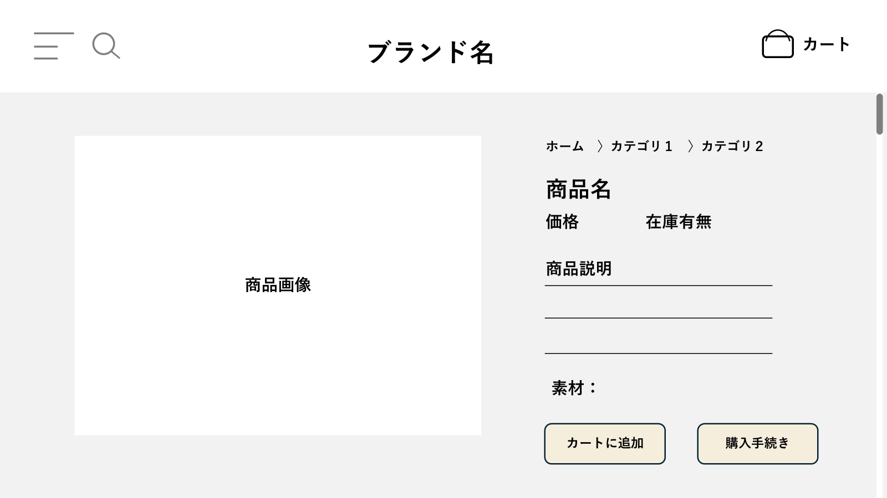

# シンプル雑貨オンライン詳細設計書（必須機能のみ）

※本バージョンは、基本設計の中から必須機能（商品閲覧、カート操作、非会員としての注文確定）の実装に絞った構成としています。

| ドキュメントバージョン | 1.0                                   |
| :------------------- | :------------------------------------ |
| 作成日               | 2025年4月6日                          |
| 作成チーム           | Jobs                        |
| 更新履歴             | 2025/04/06: Ver.1.0 初版作成 (Jobs) |

## 1. はじめに

### 1.1. 本書の目的

本書は、「シンプル雑貨オンライン」新規構築プロジェクトにおける詳細設計の内容を定義するものである。基本設計書 Ver.1.0 で定義された内容に基づき、実装担当者がプログラミング作業を迷いなく進められるように、システムの内部構造、処理フロー、インターフェース、データベース構造、画面項目などを具体的に記述する。

### 1.2. 前提となる基本設計書

本書は、以下の基本設計書の内容を前提とする。

   ECサイトシステム 基本設計書

### 1.3. 対象読者

本書は、以下の担当者を対象とする。

- 本システムのバックエンド開発担当者
- 本システムのフロントエンド開発担当者
- 本システムのテスト担当者
- プロジェクト管理者

### 1.4. 参考文献

- ECサイトシステム 基本設計書
- (チーム内で使用するコーディング規約などがあれば記載)

## 2. システム概要

### 2.1. システムの目的

- オンライン販売チャネルの確立
- 商品魅力の訴求
- 顧客利便性の向上
- 業務効率化

＊詳細は、要件定義書参照

### 2.2. 対象ユーザー

| 区分   | 役割 | 利用内容 |
|--------|------|-----------|
| 顧客   | 商品購入者 | 商品閲覧、カート操作、注文手続き |
| 管理者 | 〇〇社担当者 | 商品管理、注文確認、発送準備など |

### 2.3. システム構成図

<div class="mermaid">
graph LR
    顧客端末[顧客PC/スマホ<br>（Chrome/Safariなど）] -- HTTPS --> ECサーバ[ECサイト Webサーバ]
    管理端末[管理者PC<br>（社内担当者）] -- HTTPS --> ECサーバ
    ECサーバ --> DB[(商品情報DB・注文DB)]
    ECサーバ --> ストレージ[(商品画像等ファイルストレージ)]
    ECサーバ --> メール[(メール通知サーバ)]
    管理端末 --> 認証システム[(Active Directory)] --> ECサーバ
 
    style 顧客端末 fill:#fff8dc,stroke:#333
    style 管理端末 fill:#fff8dc,stroke:#333
    style ECサーバ fill:#cdeeff,stroke:#333,stroke-width:2px
    style DB fill:#e0ffe0,stroke:#333
    style ストレージ fill:#f9f,stroke:#333
    style メール fill:#ffe599,stroke:#333
</div>

### 2.4. 外部インターフェース概要

- **Active Directory**: ユーザー認証のために連携を行う場合がある。（オプション）

- **メール送信機能（SMTP連携）**：注文完了時に、顧客へ自動で確認メールを送信する


## 3. 機能仕様

### 3.1. 機能一覧

#### 顧客向け機能
 
- F101   :商品一覧表示
- F102   :商品詳細表示
- F103-01:カート追加
- F103-02:カート編集
- F103-03:カート消去
- F104:注文情報入力
- F105:注文確定（完了画面／メール通知）


### 3.2. 機能詳細

主要機能における、ユーザー操作から始まるフロントエンドとバックエンドAPI間の連携、およびバックエンド内部のクラス間連携の概要をシーケンス図で示す。

（エラー処理の詳細は一部省略している。APIの詳細な仕様は「5. インターフェース仕様 (API)」を参照。）
#### 顧客向け機能
#### 3.2.1. 商品一覧表示機能 (F101)

ユーザーが商品一覧ページにアクセスした際の処理フローである。

<div class="mermaid">
sequenceDiagram
    participant User as ユーザー (ブラウザ)
    participant FE as フロントエンド (JS)
    participant ProductController
    participant ProductService
    participant ProductRepository
    participant DB as データベース

    User->>FE: 商品一覧ページへアクセス
    FE->>ProductController: GET /api/products
    ProductController->>ProductService: getAllProducts()
    ProductService->>ProductRepository: findAll()
    ProductRepository->>DB: SELECT * FROM products
    DB-->>ProductRepository: 商品データリスト
    ProductRepository-->>ProductService: List<Product>
    ProductService->>ProductService: ProductエンティティからProductListItem DTOへ変換
    ProductService-->>ProductController: List<ProductListItem>
    ProductController-->>FE: 商品リスト (JSON)
    FE-->>User: 商品一覧画面を表示
</div>

**補足:**

- まずは全件取得・表示を目指す。ページネーションは本演習の範囲外である。

#### 3.2.2. 商品詳細表示機能 (F102)

ユーザーが商品一覧から特定の商品を選択し、詳細ページを表示する際の処理フローである。

<div class="mermaid">
sequenceDiagram
    participant User as ユーザー (ブラウザ)
    participant FE as フロントエンド (JS)
    participant ProductController
    participant ProductService
    participant ProductRepository
    participant DB as データベース

    User->>FE: 商品一覧画面で特定の商品をクリック (商品ID)
    FE->>ProductController: GET /api/products/{productId}
    ProductController->>ProductService: getProductById(productId)
    ProductService->>ProductRepository: findById(productId)
    ProductRepository->>DB: SELECT * FROM products WHERE product_id = ?
    DB-->>ProductRepository: 商品データ (該当商品)
    ProductRepository-->>ProductService: Optional<Product>
    alt 商品が存在する場合
        ProductService->>ProductService: ProductエンティティからProductDetail DTOへ変換
        ProductService-->>ProductController: ProductDetail
        ProductController-->>FE: 商品詳細データ (JSON)
        FE-->>User: 商品詳細画面を表示
    else 商品が存在しない場合
        ProductService-->>ProductController: (エラー情報)
        ProductController-->>FE: 404 Not Found レスポンス
        FE-->>User: 商品が見つからない旨の表示
    end
</div>

#### 3.2.3. カート操作（追加・編集・削除）機能 (F103)

**カートに追加**
ユーザーが商品詳細ページで「カートに入れる」ボタンを押した際の処理フローである。カート情報はHTTPセッションで管理する。

<div class="mermaid">
sequenceDiagram
    participant User as ユーザー (ブラウザ)
    participant FE as フロントエンド (JS)
    participant CartController
    participant CartService
    participant ProductRepository
    participant HttpSession as HTTPセッション

    User->>FE: 商品詳細画面で「カートに入れる」クリック (商品ID, 数量)
    FE->>CartController: POST /api/cart (リクエストボディ: { productId: ..., quantity: ... })
    CartController->>CartService: addItemToCart(productId, quantity, httpSession)
    CartService->>ProductRepository: findById(productId)  // 商品存在確認・価格取得
    ProductRepository-->>CartService: Optional<Product>
    alt 商品が存在する場合
        CartService->>HttpSession: getAttribute("cart") // 現在のカート情報をセッションから取得
        HttpSession-->>CartService: Cartオブジェクト (存在しない場合はnull)
        CartService->>CartService: カートオブジェクトに商品を追加/数量更新
        CartService->>HttpSession: setAttribute("cart", updatedCart) // 更新したカート情報をセッションに保存
        CartService-->>CartController: 更新後のカート情報 (Cart DTO)
        CartController-->>FE: カート追加成功レスポンス (JSON: 更新後のカート情報)
        FE-->>User: カート追加完了メッセージ表示 / カートアイコン更新
    else 商品が存在しない場合
        CartService-->>CartController: (商品が見つからないエラー情報)
        CartController-->>FE: 404 Not Found レスポンス
        FE-->>User: エラーメッセージ表示
    end
</div>

**補足:**

- カートオブジェクト (`Cart`) やカート内アイテム (`CartItem`) のクラス設計は「4. クラス設計」で定義する。
- Spring Boot標準のHttpSession利用を基本とする。


**カートを編集・削除**
ユーザーがカートの中身を確認、数量変更、削除する際の処理フローである。

**カート情報取得 (GET /api/cart)**

<div class="mermaid">
sequenceDiagram
    participant User as ユーザー (ブラウザ)
    participant FE as フロントエンド (JS)
    participant CartController
    participant CartService
    participant HttpSession as HTTPセッション

    User->>FE: カートアイコンクリックなどでカート画面へ遷移指示
    FE->>CartController: GET /api/cart
    CartController->>CartService: getCart(httpSession)
    CartService->>HttpSession: getAttribute("cart")
    HttpSession-->>CartService: Cartオブジェクト (or null、空カートオブジェクト)
    CartService->>CartService: カート情報からCart DTOへ変換
    CartService-->>CartController: Cart DTO (カート情報)
    CartController-->>FE: カート情報 (JSON)
    FE-->>User: カート画面を表示
</div>

**カート数量変更 (PUT /api/cart/items/{itemId})**

<div class="mermaid">
sequenceDiagram
    participant User as ユーザー (ブラウザ)
    participant FE as フロントエンド (JS)
    participant CartController
    participant CartService
    participant HttpSession as HTTPセッション

    User->>FE: カート画面で数量変更 (アイテムID, 新しい数量)
    FE->>CartController: PUT /api/cart/items/{itemId} (リクエストボディ: { quantity: ... })
    CartController->>CartService: updateItemQuantity(itemId, quantity, httpSession)
    CartService->>HttpSession: getAttribute("cart")
    HttpSession-->>CartService: Cartオブジェクト
    CartService->>CartService: 指定されたアイテムの数量を更新
    CartService->>HttpSession: setAttribute("cart", updatedCart)
    CartService-->>CartController: 更新後のカート情報 (Cart DTO)
    CartController-->>FE: 更新成功レスポンス (JSON: 更新後のカート情報)
    FE-->>User: カート画面の表示更新
</div>

**カート商品削除 (DELETE /api/cart/items/{itemId})** (上記PUTと同様の流れ)

#### 3.2.4. 注文確定（完了画面／メール通知） (F105)

ユーザーが注文確認画面で「注文を確定する」ボタンを押した際の処理フローである。（非会員注文）

<div class="mermaid">
sequenceDiagram
    participant User as ユーザー (ブラウザ)
    participant FE as フロントエンド (JS)
    participant OrderController
    participant OrderService
    participant CartService
    participant ProductRepository
    participant OrderRepository
    participant EmailService
    participant HttpSession as HTTPセッション
    participant DB as データベース

    User->>FE: 注文確認画面で「注文を確定する」クリック
    FE->>OrderController: POST /api/orders (リクエストボディ: 注文者情報DTO)
    OrderController->>CartService: getCart(httpSession) // カート情報を取得
    CartService-->>OrderController: Cartオブジェクト

    alt カートが空でない場合
        OrderController->>OrderService: placeOrder(cart, orderRequestDto)
        OrderService->>OrderService: 入力値バリデーション
        OrderService->>ProductRepository: findById(productId) // 在庫確認 (ロックなし)
        ProductRepository->>DB: SELECT ...
        DB-->>ProductRepository: 商品情報リスト
        ProductRepository-->>OrderService: List<Product>
        alt 在庫あり
            OrderService->>ProductRepository: decreaseStock(productId, quantity) // 在庫減算
            ProductRepository->>DB: UPDATE products SET stock = stock - ? WHERE product_id = ? AND stock >= ?
            DB-->>ProductRepository: 更新結果 (件数)
            ProductRepository-->>OrderService: (成功/失敗)

            OrderService->>OrderService: 注文情報(Order)・注文明細(OrderDetail)エンティティ作成
            OrderService->>OrderRepository: save(order) // 注文情報保存
            OrderRepository->>DB: INSERT INTO orders ..., INSERT INTO order_details ...
            DB-->>OrderRepository: 保存結果
            OrderRepository-->>OrderService: 保存されたOrderエンティティ

            **OrderService->>EmailService: sendOrderConfirmationEmail(order, customerEmail)**
            **EmailService->>EmailService: メールテンプレート適用, メッセージ作成**
            **EmailService-->>OrderService: 送信結果**

            OrderService->>CartService: clearCart(httpSession) // カートを空にする
            CartService->>HttpSession: removeAttribute("cart")
            HttpSession-->>CartService: (完了)
            CartService-->>OrderService: (完了)

            OrderService->>OrderService: OrderResponse DTOへ変換
            OrderService-->>OrderController: OrderResponse DTO
            OrderController-->>FE: 201 Created レスポンス (JSON: { orderId: ... })
            FE-->>User: 注文完了画面表示
        else 在庫なし or DBエラー
            OrderService->>OrderService: (Rollback処理 - @Transactionalにより自動)
            OrderService-->>OrderController: エラー情報
            Controller-->>FE: 4xx or 5xx エラーレスポンス
            FE-->>User: エラーメッセージ表示
        end
    else カートが空の場合
        OrderController-->>FE: 400 Bad Request レスポンス
        FE-->>User: エラーメッセージ表示
    end
</div>

**補足:**

- `@Transactional` アノテーションを `OrderService#placeOrder` メソッドに付与し、DB操作の原子性を保証する。
- 在庫更新時のロック処理は本演習では実装しない。


## 4. クラス設計

ここでは、「シンプル雑貨オンライン」バックエンド（Spring Boot）アプリケーションのクラス構造について定義する。主要なパッケージ構成、クラス図、主要クラスの説明、およびデータ転送オブジェクト（DTO）の定義を示す。

### 4.1. 主要パッケージ構成

ソースコードの整理と見通しを良くするため、以下のようなパッケージ構成(例)を基本とする。ルートパッケージは `com.simplezakka.online`(仮)とする。

```

com.simplezakka.online
├── SimpleZakkaOnlineApplication.java  // Spring Boot起動クラス
│
├── controller      // HTTPリクエスト処理、APIエンドポイント定義
│   ├── ProductController.java
│   ├── CartController.java
│   └── OrderController.java
│
├── service         // ビジネスロジック実装
│   ├── ProductService.java
│   ├── CartService.java     // カート(セッション)操作ロジック
│   └── OrderService.java
│
├── repository      // データベースアクセス (Spring Data JPA)
│   ├── ProductRepository.java
│   ├── OrderRepository.java
│   └── OrderItemRepository.java
│
├── entity          // DBテーブルに対応するJPAエンティティ
│   ├── Product.java
│   ├── Order.java
│   └── OrderDetail.java
│
├── dto             // Data Transfer Object (API入出力、レイヤー間データ転送用)
│   ├── product
│   │   ├── ProductListItem.java
│   │   └── ProductDetail.java
│   ├── cart
│   │   ├── Cart.java         // カート全体を表すDTO (セッション格納用でもある)
│   │   └── CartItem.java     // カート内商品を表すDTO
│   │   ├── CartItemInfo.java
│   │   └── CartItemQuantityDto.java
│   └── order
│       ├── OrderRequest.java
│       ├── CustomerInfo.java // OrderRequest内で使用 (非会員用)
│       └── OrderResponse.java
│
├── exception       // 例外ハンドリング
│   └── GlobalExceptionHandler.java // 基本的な例外ハンドリング
│
└── config
    └── DataLoader.java // サンプルデータロード用
```
    


**補足:**

- Service層のインターフェースと実装クラスの分離は不要。

### 4.2. クラス図

主要な機能ドメイン（商品、カート、注文）に関するクラスとその関連を示す。

#### 4.2.1. 商品関連クラス図

<div class="mermaid">
classDiagram
    %% Controller
    class ProductController {
        +ProductService productService
        +getAllProducts() ResponseEntity~List~ProductListItem~~
        +getProductById(productId) ResponseEntity~ProductDetail~
    }

    %% Service
    class ProductService {
        +ProductRepository productRepository
        +findAllProducts() List~ProductListItem~
        +findProductById(productId) ProductDetail
    }

    %% Repository
    class ProductRepository {
        <<Interface>>
        +JpaRepository~Product, Integer~
        +findAll() List~Product~
        +findById(productId) Optional~Product~
    }

    %% Entity
    class Product {
        <<Entity>>
        +Integer productId
        +String name
        +String description
        +Integer price
        +Integer stock
        +String material
        +String imageUrl
          
        +Boolean isRecommended "Nullable" // 必要に応じて
        +LocalDateTime createdAt "Nullable"
        +LocalDateTime updatedAt "Nullable"
    }

    %% DTO
    class ProductListItem {
        <<DTO>>
        +Integer productId
        +String name
        +Integer price
        +Integer stock
        +String imageUrl
    }

    class ProductDetail {
        <<DTO>>
        +Integer productId
        +String name
        +Integer price
        +String description
        +Integer stock
        +String imageUrl
    }

    %% 関係
    ProductController --> ProductService : uses
    ProductService --> ProductRepository : uses
    ProductRepository --> Product : manages
    ProductService --> ProductListItem : creates
    ProductService --> ProductDetail : creates

</div>


#### 4.2.2. カート関連クラス図 (セッション管理)
<div class="mermaid">
classDiagram
    %% Controller
    class CartController {
        +CartService cartService
        +getCart(HttpSession) ResponseEntity~Cart~
        +addItem(CartItemInfo, HttpSession) ResponseEntity~Cart~
        +updateItem(itemId, CartItemQuantityDto, HttpSession) ResponseEntity~Cart~
        +removeItem(itemId, HttpSession) ResponseEntity~Cart~
    }

    %% Service
    class CartService {
        +ProductRepository productRepository
        +getCartFromSession(HttpSession) Cart
        +addItemToCart(productId, quantity, HttpSession) Cart
        +updateItemQuantity(itemId, quantity, HttpSession) Cart
        +removeItemFromCart(itemId, HttpSession) Cart
        +clearCart(HttpSession) void
    }

    %% DTO
    class Cart {
        <<DTO/Session Object>>
        +Map~String, CartItem~ items
        +int totalQuantity
        +int totalPrice
        +addItem(product, quantity) void
        +updateQuantity(itemId, quantity) void
        +removeItem(itemId) void
        +calculateTotals() void
    }

    class CartItem {
        <<DTO/Session Object>>
        +String id  // カート内でのユニークID (例: productIdをString化)
        +Integer productId
        +String name
        +Integer price
        +String imageUrl
        +int quantity
        +int subtotal
    }

    class CartItemInfo {
        <<DTO>>
        +Integer productId
        +Integer quantity
    }

    class CartItemQuantityDto {
         <<DTO>>
        +Integer quantity
    }

    %% 関係
    CartController --> CartService : uses
    CartService --> Cart : returns
    CartService --> CartItem : creates
    CartController ..> CartItemInfo : receives
    CartService --> CartItemQuantityDto : receives

</div>


#### 4.2.3. 注文関連クラス図 (非会員注文)
<div class="mermaid">
classDiagram
    %% Controller
    class OrderController {
        +OrderService orderService
        +CartService cartService
        +placeOrder(OrderRequest, HttpSession) ResponseEntity~OrderResponse~
    }

    %% Service
    class OrderService {
        +OrderRepository orderRepository
        +OrderDetailRepository orderDetailRepository
        +ProductRepository productRepository
        +CartService cartService
        +placeOrder(Cart, OrderRequest) OrderResponse
    }

    %% Repository
    class OrderRepository {
       <<Interface>>
        +JpaRepository~Order, Integer~
    }

    class OrderItemRepository {
       <<Interface>>
        +JpaRepository~OrderDetail, Integer~
    }

    %% Entity
    class Order {
        <<Entity>>
        +Integer orderId
        +Integer customerId
        +Integer statusId
        +LocalDateTime createdAt "Nullable"
        +LocalDateTime updatedAt "Nullable"
    }

    class OrderDetail {
        <<Entity>>
        +Integer orderDetailId
        +Order order
        +Product product
        +String productName // 冗長
        +Integer price // 注文時点
        +Integer quantity
    }

    %% DTO
    class OrderRequest {
        <<DTO>>
        +CustomerInfo customerInfo // 注文者情報(非会員用)
    }

    class CustomerInfo {
        <<DTO>>
        +String name
        +String email
        +String address
        +String phoneNumber
    }

    class OrderResponse {
        <<DTO>>
        +Integer orderId
        +LocalDateTime orderDate
    }

    %% 関係
    OrderController --> OrderService : uses
    OrderService --> OrderRepository : uses
    OrderService --> OrderItemRepository : uses
    OrderService --> Order : creates
    OrderService --> OrderDetail : creates
    OrderService --> OrderResponse : returns
    OrderService --> OrderRequest : receives
    OrderRequest --> CustomerInfo : has
    OrderRequest --> CartItem : contains
    OrderDetail --> Order : belongsTo
    OrderDetail --> Product : references

 </div>


### 4.3. 主要クラス説明

各レイヤーのクラスの役割と、シンプル雑貨オンラインにおける代表的なクラス名は以下の通りである。

- **Controller (`@RestController`)**: フロントエンドからのHTTPリクエストを受け付け、Serviceを呼び出し、結果をJSON形式で返す責務を持つ。URLルーティング、リクエストデータの受け取りと基本的なバリデーション、レスポンスの生成を担当する。
    - 例: `ProductController`, `CartController`, `OrderController`
- **Service (`@Service`)**: アプリケーションのビジネスロジックを実装する責務を持つ。Controllerから依頼を受け、必要に応じて複数のRepositoryを操作し、結果をControllerに返す。基本的なトランザクション管理も主にこの層で行う。
    - 例: `ProductService`, `CartService`, `OrderService`
- **Repository (`@Repository`)**: データベースへのアクセス（基本的なCRUD操作）を担当するインターフェースである。Spring Data JPAを利用し、`JpaRepository`を継承することで基本的なDB操作メソッドが提供される。複雑なクエリの利用は最小限に留める。
    - 例: `ProductRepository`, `OrderRepository`, `OrderItemRepository`
- **Entity (`@Entity`)**: データベースのテーブル構造にマッピングされるJavaオブジェクトである。テーブルのカラムに対応するフィールドを持ち、JPAのアノテーションが付与される。
    - 例: `Product`, `Order`, `OrderItem`
- **DTO (Data Transfer Object)**: レイヤー間（特にControllerとService、APIの境界）でデータを転送するためのオブジェクトである。APIのリクエスト/レスポンス形式の定義にも使用される。
    - 例:`Cart`, `CartItem`, `OrderResult`


### 4.4. DTO定義

主要なAPIや機能で使用されるDTOの構造を示す。 (バリデーションルールは簡略化)

**商品関連 DTO**

```java
// 商品一覧用
public class ProductListItem {
    private Integer productId;
    private String name;
    private Integer price;
    private String imageUrl;
    // getters, constructor
}

// 商品詳細用
public class ProductDetail {
    private Integer productId;
    private String name;
    private Integer price;
    private String description;
    private Integer stock;
    private String imageUrl;
    // getters, constructor
}
```

**カート関連 DTO**

```java
// カート全体 (セッション格納/APIレスポンス用)
public class Cart {
    private Map<String, CartItem> items = new LinkedHashMap<>();
    private int totalQuantity;
    private int totalPrice;
    // メソッド: addItem, updateQuantity, removeItem, calculateTotals など
    // getters
}

// カート内商品 (セッション格納/APIレスポンス用)
public class CartItem {
    private String id;
    private Integer productId;
    private String name;
    private Integer price;
    private String imageUrl;
    private int quantity;
    private int subtotal;
    // getters, setters, constructor
}

// カート追加APIリクエスト用
public class CartItemInfo {
    @NotNull
    private Integer productId;
    @NotNull @Min(1)
    private Integer quantity;
    // getters, setters
}

// カート数量更新APIリクエスト用
public class CartItemQuantityDto {
    @NotNull @Min(1)
    private Integer quantity;
    // getters, setters
}
```

**注文関連 DTO**

```java
// 注文APIリクエスト用
public class OrderRequest {
    @Valid // ネストしたDTOのバリデーションを有効化
    @NotNull
    private CustomerInfo customerInfo;
    // getters, setters
}

// 注文APIリクエスト内の顧客情報用 (非会員用)
public class CustomerInfo {
    @NotBlank
    private String name;
    @NotBlank @Email
    private String email;
    @NotBlank
    private String address;
    @NotBlank
    private String phoneNumber;
    // getters, setters
}

// 注文APIレスポンス用
public class OrderResponse {
    private Integer orderId;
    private LocalDateTime orderDate;
    // getters, constructor
}
```

**補足:**

- 上記DTOには、基本的なバリデーションのためのアノテーション (`@NotNull`, `@NotBlank`, `@Email`, `@Min`, `@Valid`) を付与している。Controller層での入力チェックに使用される。
- コンストラクタやGetter/Setterは記述を省略しているが、実際には必要（Lombokライブラリの使用も可）。
# 5. インターフェース仕様

## 5.1 API一覧
| 機能            | HTTPメソッド | エンドポイントURL                  |
| ------------- | -------- | --------------------------- |
| 商品一覧表示（F101）        | `GET`    | `/api/products`             |
| 商品詳細表示(F102)        | `GET`    | `/api/products/{productId}` |
| カート追加(F103-01)         | `POST`   | `/api/cart`                 |
| カート編集（F103-02） | `PUT`    | `/api/cart/{itemId}`        |
| カート削除(F103-03)         | `DELETE` | `/api/cart/{itemId}`        |
| 注文情報入力（F104）   | `POST`   | `/api/orders/confirm`       |
| 注文確定(F105)          | `POST`   | `/api/orders/complete`      |


## 5.2 API詳細 

### 商品一覧表示

- **HTTPメソッド**：`GET`  
- **エンドポイント**：`/api/products`

#### クエリパラメータ

| 名前 | 型 | 必須 | 説明 |
|------|----|------|------|
| page | number | いいえ | ページ番号（例: 1） |
| limit | number | いいえ | 表示件数（例: 20） |

#### レスポンス（200 OK）

```json
{
  "products": [
    {
      "id": 1,
      "name": "商品A",
      "price": 1500,
      "stock": 12,
      "thumbnailUrl": "/images/productA.jpg"
    }
  ],
  "total": 100
}
```

#### エラー（500）

```json
{
  "error": "Internal server error"
}
```

---

### 商品詳細表示

- **HTTPメソッド**：`GET`  
- **エンドポイント**：`/api/products/{productId}`

#### パスパラメータ

| 名前 | 型 | 説明 |
|------|----|------|
| productId | int | 商品のID |

#### レスポンス（200 OK）

```json
{
  "id": 1,
  "name": "商品A",
  "description": "詳細説明",
  "price": 1500,
  "stock": 12,
  "images": ["/images/a1.jpg", "/images/a2.jpg"]
}
```

#### エラー（404）

```json
{
  "error": "Product not found"
}
```

---

### カート追加

- **HTTPメソッド**：`POST`  
- **エンドポイント**：`/api/cart`

#### リクエストボディ

```json
{
  "productId": 1,
  "quantity": 2
}
```

#### レスポンス（201 Created）

```json
{
  "message": "Item added to cart",
  "cartItemId": 123
}
```

#### エラー（400）

```json
{
  "error": "Invalid quantity or product ID"
}
```

---

### カート編集（数量変更）

- **HTTPメソッド**：`PUT`  
- **エンドポイント**：`/api/cart/{itemId}`

#### パスパラメータ

| 名前 | 型 | 説明 |
|------|----|------|
| itemId | int | カート内商品ID |

#### リクエストボディ

```json
{
  "quantity": 3
}
```

#### レスポンス（200 OK）

```json
{
  "message": "Quantity updated"
}
```

#### エラー（404）

```json
{
  "error": "Cart item not found"
}
```

---

### カート削除

- **HTTPメソッド**：`DELETE`  
- **エンドポイント**：`/api/cart/{itemId}`

#### レスポンス（200 OK）

```json
{
  "message": "Item removed from cart"
}
```

---

### 注文情報入力（仮注文）

- **HTTPメソッド**：`POST`  
- **エンドポイント**：`/api/orders/confirm`

#### リクエストボディ

```json
{
  "customer": {
    "name": "山田 太郎",
    "email": "taro@example.com",
    "address": "東京都港区〜"
  },
  "items": [
    { "productId": 1, "quantity": 2 },
    { "productId": 3, "quantity": 1 }
  ]
}
```

#### レスポンス（200 OK）

```json
{
  "orderPreview": {
    "totalAmount": 5400,
    "shippingFee": 500
  }
}
```

---

### 注文確定

- **HTTPメソッド**：`POST`  
- **エンドポイント**：`/api/orders/complete`

#### リクエストボディ（confirmと同様）

#### レスポンス（201 Created）

```json
{
  "orderId": 9876,
  "message": "Order completed",
  "emailSent": true
}
```


# 6 DB定義

## 6.1 データベース定義

## テーブル定義書

以下は、ER図と設計方針に基づいた各テーブルの定義を示している。

---
### PRODUCT（商品マスタ）

| No | カラム名      | データ型       | 主キー | NOT NULL | 説明                            |
|----|---------------|----------------|--------|-----------|---------------------------------|
| 1  | product_id    | INT            | ○      | ○         | 商品ID（                   |
| 2  | name          | VARCHAR(255)   |        | ○         | 商品名                           |
| 3  | description   | TEXT           |        |           | 商品説明                         |
| 4  | price         | INT            |        | ○         | 商品価格（税抜）                  |
| 5  | stock         | INT            |        | ○         | 商品在庫数                        |
| 6  | material      | VARCHAR(100)   |        |           | 素材                             |
| 7  | image_path    | VARCHAR(255)   |        |           | 商品画像の保存パスまたはURL         |
| 8  | created_at    | DATETIME       |        | ○         | 作成日時                         |
| 9  | updated_at    | DATETIME       |        | ○         | 最終更新日時                      |

**インデックス**: `name`

---

### ORDERS（注文テーブル）

| No | カラム名    | データ型   | 主キー | NOT NULL | 説明            |
|----|-------------|------------|--------|-----------|-----------------|
| 1  | order_id    | INT        | ○      | ○         | 注文ID   |
| 2  | order_date  | DATETIME   |        | ○         | 注文日           |

**インデックス**: `order_date`

---

### ORDER_DETAIL（注文詳細テーブル）

| No | カラム名         | データ型       | 主キー | NOT NULL | 説明                                |
|----|------------------|----------------|--------|-----------|-------------------------------------|
| 1  | order_detail_id  | INT            | ○      | ○         | 注文明細ID                           |
| 2  | order_id         | INT            |        | ○         | 注文ID（ORDERSテーブルの外部キー）      |
| 3  | product_id       | INT            |        | ○         | 商品ID（PRODUCTテーブルの外部キー）     |
| 4  | product_name     | VARCHAR(255)   |        | ○         | 商品名（注文時点の情報）                |
| 5  | price            | INT            |        | ○         | 商品単価（注文時点）                   |
| 6  | quantity         | INT            |        | ○         | 注文数                               |

**インデックス**: `order_id`, `product_id`


### 6.2 ER図

 
<div class="mermaid">
erDiagram

  PRODUCT {
    INT product_id PK 
    VARCHAR name 
    TEXT description 
    INT price 
    INT stock 
    VARCHAR material 
    VARCHAR image_path 
    DATETIME created_at 
    DATETIME updated_at 
  }

  ORDERS {
    INT order_id PK 
    DATETIME order_date 
  }

  ORDER_DETAIL {
    INT order_detail_id PK 
    INT order_id FK 
    INT product_id FK 
    VARCHAR product_name 
    INT price 
    INT quantity 
  }

  PRODUCT ||--o{ ORDER_DETAIL : "references"
  ORDERS ||--o{ ORDER_DETAIL : "contains"
  </div>


### 6.3 トランザクション設計


## フローの説明

 **トランザクション開始**: 注文処理のメソッドが呼び出されるとトランザクションが開始される。
 **在庫確認**: 注文された商品の在庫を確認する。
 **在庫ありか判定**: 在庫がある場合のみ次へ進む。ない場合は例外を投げてロールバックされる。
 **在庫減算**: 在庫数を減らす。
 **注文情報作成**: 注文のメイン情報を作成（注文者、日付など）。
 **注文詳細作成**: 各商品ごとの注文明細を作成。
 **注文情報保存**: 注文情報をデータベースに保存。
 **注文詳細保存**: 注文明細もデータベースに保存。
 **トランザクションコミット**: すべての処理が正常に完了した場合、トランザクションが確定される。
 **エラー発生時のロールバック**: 在庫が不足しているなどの理由で例外が発生した場合、それまでのすべての処理はロールバックされる。


---

## 7. 画面項目定義

### 7.1.画面一覧

| 画面ID | 画面名               | 概要説明                                                                 |
|--------|----------------------|--------------------------------------------------------------------------|
| S01    | トップページ         | ユーザーがサイトにアクセスした際に最初に表示される画面で、商品検索やおすすめ商品の一覧を提供します。 |
| S02    | 商品一覧画面         | 選択されたカテゴリや検索キーワードに応じた商品を一覧形式で表示する画面です。              |
| S03    | 商品詳細画面         | 選択した商品の詳細情報（画像・説明・価格など）を表示し、カート追加操作を行える画面です。      |
| S04    | カート画面           | ユーザーが選択した商品一覧を確認・編集（数量変更や削除）し、購入手続きに進むための画面です。   |
| S05    | 注文情報入力画面     | 顧客情報（氏名・住所・電話番号など）を入力し、注文に必要な情報を登録する画面です。         |
| S06    | 注文確認画面         | 入力済みの注文情報と購入内容を最終確認し、注文確定操作を行う画面です。                   |
| S07    | 注文完了画面         | 注文手続きが正常に完了したことを通知し、トップページへの遷移を促す画面です。              |


### 7.2.画面項目定義書


##### トップページ(S01)
| 項目名       | ラベル名       | UI部品 | データ型 | 入力 | 初期値 | サイズ | 文字種 | バリデーションルール | エラーメッセージ       |
|--------------|----------------|--------|----------|------|--------|--------|--------|----------------------|------------------------|
| メインバナー |                | 画像   | パス     | ×    | -      | -      | 半角英数 | 存在確認              | バナーが表示されません |
| 商品検索欄   | キーワード検索 | テキスト | 文字列 | ○    | -      | 50     | 全角/半角 | 文字数制限あり         | 入力が長すぎます       |
| 検索ボタン   | 検索           | ボタン  | -       | ○    | -      | -      | -      | クリックイベント      | 検索に失敗しました     |

##### 商品一覧画面(S02)

| 項目名          | ラベル名        | UI部品 | データ型      | 入力 | 初期値 | サイズ | 文字種     | バリデーションルール | エラーメッセージ       |
|-----------------|-----------------|--------|---------------|------|--------|--------|------------|----------------------|------------------------|
| 商品画像        |                 | 画像   | 文字列（パス） | ×    | -      | -      | 半角英数   | 存在確認              | 画像が表示できません    |
| 商品名          | 商品名          | テキスト | 文字列       | ×    | -      | 50     | 全角/半角  | -                    | -                      |
| 価格            | 価格（税込）    | テキスト | 数値         | ×    | -      | 10     | 半角数字   | 数値チェック          | 価格が不正です         |
| カート追加ボタン | カートに追加    | ボタン  | なし          | ○    | -      | -      | -          | クリックイベント      | 追加に失敗しました      |

##### 商品詳細画面(S03)

| 項目名     | ラベル名     | UI部品   | データ型  | 入力 | 初期値 | サイズ | 文字種   | バリデーションルール | エラーメッセージ         |
|------------|--------------|----------|----------|------|--------|--------|----------|----------------------|--------------------------|
| 商品画像    |              | 画像     | パス      | ×    | -      | -      | 半角英数 | 存在確認              | 商品画像が見つかりません |
| 商品名      | 商品名       | テキスト | 文字列   | ×    | -      | 50     | 全角/半角| -                    | -                        |
| 商品説明    | 説明         | テキスト | 文字列   | ×    | -      | 300    | 全角     | -                    | -                        |
| 素材        | 素材         | テキスト | 文字列   | ×    | -      | 100    | 全角     | -                    | -                        |
| カート追加ボタン | カートに追加 | ボタン  | -        | ○    | -      | -      | -        | -                    | 追加に失敗しました        |

##### カート画面(S04)

| 項目名     | ラベル名   | UI部品 | データ型 | 入力 | 初期値 | サイズ | 文字種 | バリデーションルール | エラーメッセージ            |
|------------|------------|--------|----------|------|--------|--------|--------|----------------------|-----------------------------|
| 商品名      | 商品名     | テキスト | 文字列 | ×    | -      | 50     | 全角   | -                    | -                           |
| 数量        | 数量       | 数値入力 | 数値   | ○    | 1      | 3      | 半角数字 | 数値チェック           | 数量が不正です             |
| 削除ボタン   | 削除       | ボタン  | -       | ○    | -      | -      | -      | クリックイベント      | 削除に失敗しました         |
| 合計金額    | 合計       | テキスト | 数値   | ×    | -      | 10     | 半角数字 | -                    | -                           |
| 注文手続きボタン | 注文手続き | ボタン  | -       | ○    | -      | -      | -      | -                    | 手続きに進めませんでした |

##### 注文情報入力画面(S05)

| 項目名     | ラベル名     | UI部品 | データ型 | 入力 | 初期値 | サイズ | 文字種 | バリデーションルール   | エラーメッセージ       |
|------------|--------------|--------|----------|------|--------|--------|--------|------------------------|--------------------------|
| 氏名        | 氏名         | テキスト | 文字列 | ○    | -      | 30     | 全角   | 必須                    | 氏名を入力してください     |
| 住所        | 配送先住所   | テキスト | 文字列 | ○    | -      | 100    | 全角   | 必須                    | 住所を入力してください     |
| 電話番号     | 電話番号     | テキスト | 数値   | ○    | -      | 15     | 半角数字 | 電話番号形式チェック     | 正しい電話番号を入力してください |

##### 注文確認画面(S06)

| 項目名     | ラベル名   | UI部品 | データ型 | 入力 | 初期値 | サイズ | 文字種 | バリデーションルール | エラーメッセージ          |
|------------|------------|--------|----------|------|--------|--------|--------|----------------------|---------------------------|
| 氏名        | 氏名       | テキスト | 文字列 | ×    | -      | 30     | 全角   | -                    | -                         |
| 住所        | 配送先住所 | テキスト | 文字列 | ×    | -      | 100    | 全角   | -                    | -                         |
| 電話番号     | 電話番号   | テキスト | 数値   | ×    | -      | 15     | 半角数字 | 電話番号形式チェック   | 電話番号が不正です        |
| 合計金額    | 合計金額   | テキスト | 数値   | ×    | -      | 10     | 半角数字 | -                    | -                         |
| 注文確定ボタン | 注文確定 | ボタン  | -       | ○    | -      | -      | -      | -                    | 確定できませんでした      |

##### 注文完了画面(S07)

| 項目名         | ラベル名       | UI部品 | データ型 | 入力 | 初期値 | サイズ | 文字種 | バリデーションルール | エラーメッセージ     |
|----------------|----------------|--------|----------|------|--------|--------|--------|----------------------|----------------------|
| 完了メッセージ  | 注文ありがとうございました | テキスト | 文字列 | ×    | -      | -      | 全角   | -                    | -                    |
| トップへ戻るボタン | トップへ       | ボタン  | -        | ○    | -      | -      | -      | -                    | -                    |


### 7.3.入力チェック仕様

##### 注文情報入力画面
| 項目名     | バリデーションルール                                  | 実施場所   |
|------------|--------------------------------------------------------|------------|
| 氏名       | 必須入力、最大文字数50文字、全角/半角どちらも許容     | 両方       |
| 郵便番号   | 必須入力、半角数字7桁、正規表現：`^\d{3}-?\d{4}$`      | 両方       |
| 都道府県   | 必須入力、プルダウン選択制                             | クライアント |
| 市区町村   | 必須入力、最大50文字                                   | 両方       |
| 丁目・番地 | 任意入力、最大100文字                                  | サーバー   |
| 電話番号   | 必須入力、半角数字、正規表現：`^\d{10,11}$`            | 両方       |
| メールアドレス | 必須入力、形式チェック、最大100文字、RFC簡易準拠    | 両方       |
| 配送希望日 | 任意入力、過去日不可、未来30日以内                     | クライアント |
| 備考欄     | 任意入力、最大文字数500文字                             | サーバー   |


### 7.4.各画面の詳細なレイアウト
トップページ(S01)

商品一覧画面(S02)

商品詳細画面(S03)

カート画面(S04)

注文情報入力画面(S05)

注文確認画面(S06)

注文完了画面(S07)


## 8. 非機能要件詳細

### 8.1. 性能

本システムでは、以下の性能基準を目標とする。

- **画面応答時間**：商品一覧表示、商品詳細表示、カート表示、注文完了といった主要画面における処理応答時間は、通常時で **2秒以内** を目標とする。
- **同時接続数**：初期段階では想定同時アクセス数を **100〜200件程度** とし、この範囲内で安定したサービス提供が可能な構成とする。
- **拡張性配慮**：今後のアクセス数増加に備え、アプリケーションおよびデータベースのスケーラビリティを意識した構成とする。

**【詳細実装方針】**

- **データベース最適化**：
  - 商品一覧・検索機能などで使用されるカラムに対しインデックスを付与。
  - 複雑なJOINやサブクエリは極力避け、可能な場合はViewやキャッシュによる読み取り高速化を実施。
- **キャッシュの活用**：
  - RedisやMemcachedなどのインメモリキャッシュにより高速化。
- **画像表示最適化**：
  - CDN（例：Cloudflare）を介して配信。
  - サイズの自動圧縮とWebP形式での配信によりロード時間を短縮。
- **フロントエンドの工夫**：
  - Vue.js等のSPAフレームワークで不要なページ再読込を削減。
  - ページネーションやLazy Loadを用い、初期ロードのデータ量を制限。
- **非同期処理の導入**：
  - 在庫更新・注文履歴登録等の一部処理をLaravel Queuesなどで非同期化。
- **APMツールの導入**：
  - New RelicやDatadogなどを用いてボトルネックを随時分析可能にする。


### 8.2. セキュリティ

顧客の個人情報を取り扱うサービスとして、以下のセキュリティ対策を講じる。

- **通信の暗号化**：すべてのWeb通信は **HTTPS（TLS 1.2以上）** により暗号化。
- **入力値検証**：SQLインジェクションやXSSなどの脆弱性を防止するためのサーバーサイド検証を実装。
- **個人情報保護法の遵守**：適切な範囲で収集・利用・保管し、法令に従って管理。
- **SMTP認証情報の管理**：環境変数などで安全に管理し、ハードコードを避ける。

**【詳細実装方針】**

- **HTTPS対応**：
  - Let's Encrypt または AWS Certificate Manager による証明書を使用し、HTTPS通信を自動更新付きで常時適用。
  - HTTP → HTTPSリダイレクトを強制。
- **入力値検証・脆弱性対策**：
  - LaravelのValidation機能を用いてサニタイズ・バリデート。
  - Eloquent ORMやクエリビルダでSQLインジェクション対策。
  - Bladeテンプレートの自動エスケープ機能でXSS防止。
  - CSRFトークンを全フォームに付与。
- **パスワード管理と認証強化**：
  - bcryptでのハッシュ化保存。
  - レートリミットによる不正ログイン防止。
  - 管理者画面には2FA導入も検討。
- **SMTP情報の管理**：
  - `.env`ファイルにSMTP認証情報を格納し、コードから分離。
  - 環境別に`.env`ファイルを分けて漏洩リスクを低減。
- **ログ管理と監査**：
  - LaravelのMonologでログ分類（info, error, critical）。
  - 注文・登録などの重要操作は操作内容・ユーザーID・日時を記録。


### 8.3. 可用性

- **サービス稼働時間**：原則として、ECサイトは **24時間365日利用可能** なシステムとして設計。
- **障害時対応**：DBは **日次でバックアップ** を取得し、障害時に復旧可能とする。ログにより原因調査も実施。
- **クラウド基盤の活用**：柔軟な復旧・スケーリングが可能なクラウド構成とする。

**【詳細実装方針】**

- **クラウドインフラ構成（AWS）**：
  - EC2（Auto Scaling Group付き）
  - RDS（Multi-AZ構成）
  - S3（画像・CSV保管）
  - ALB（Application Load Balancer）
- **バックアップ設計**：
  - RDSスナップショットを毎日自動取得（7日間保存）
  - S3はバージョニング有効化
- **可用性監視**：
  - CloudWatchにより死活監視とアラート通知（メール・Slack）
  - 異常検知時は自動再起動・フェイルオーバー
- **フェイルオーバー設計**：
  - RDS自動フェイルオーバーによりスタンバイDBへ切替
  - EC2はAuto Scaling Groupで自動再起動
- **ログの集中管理**：
  - CloudWatch LogsやOpenSearch Serviceでログ集約
  - タイムスタンプ・ユーザーID・リクエストパス・エラーレベルを記録


### 8.4. その他（保守性・拡張性）

- **モジュール設計の採用**：機能追加を容易にする疎結合モジュール構成。
- **ログと監査記録**：操作ログを記録し、調査や内部統制に備える。
- **レスポンシブ対応**：各端末で快適に操作できるようデザイン対応。

**【詳細実装方針】**

- **モジュール構成例**：
  - `/modules/product/`：商品機能
  - `/modules/order/`：注文・在庫機能
  - `/modules/user/`：ユーザー機能
  - APIと画面を分離し再利用性を高める。

- **ログ・監査記録**：
  - 例：
    - 商品登録 → `{"type": "product_create", "admin_id": 101, "product_id": 1009, "timestamp": "2025-07-03T10:45:00"}`
    - 注文確定 → `{"type": "order_confirm", "user_id": 202, "order_id": 3001, "timestamp": "2025-07-03T11:05:00"}`
  - CloudWatch Logsに送信・アクセス制限付きで保管
- **レスポンシブ対応**：
  - Tailwind CSSやBootstrap 5を使用
  - モバイルファースト設計、主要解像度での検証実施
  - スムーズなカート操作・注文処理を実現


